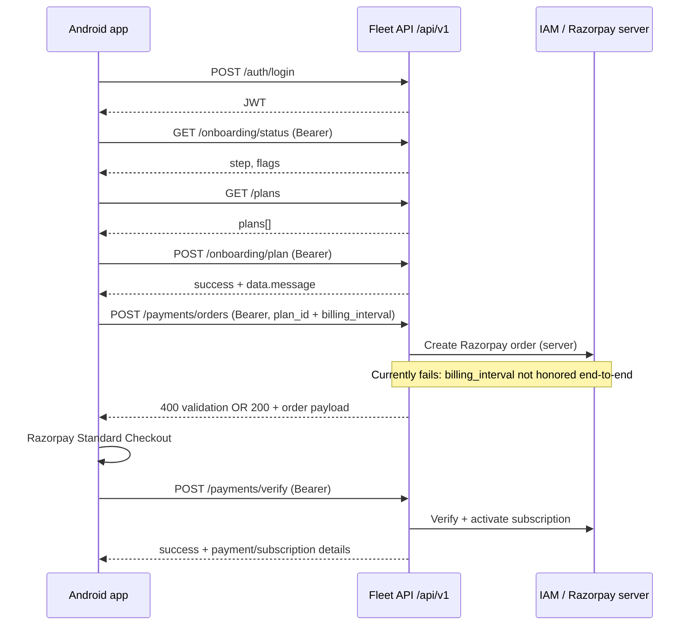

# Subscription & payment API — specification for backend (Fleet / IAM)

**Audience:** Fleet + IAM engineers responsible for routes under the Fleet gateway.  
**Source of truth (client):** Kotlin Multiplatform module `screen-payment` + `ijs-network-lib` (`ApiConfig`, `SubscriptionRemoteDataSourceImpl`, DTOs in `SubscriptionDto.kt` / `SubscriptionRequests.kt`).  
**Verified against production:** `ApiConfig.BASE_URL` as deployed **2026-04-15** using a real account (HTTP traces below; **no secrets** in this file).

**Companion doc:** [PAYMENT_APP_BACKEND_FLOW.md](./PAYMENT_APP_BACKEND_FLOW.md) (product flow + diagrams). This document is the **contract + observed behaviour** handoff for fixes.

---

## 1. Environment

| Item | Value |
|------|--------|
| **App `BASE_URL`** | `https://indusjsfleet-api-clean-architecture-refactor-960880113496.asia-south1.run.app/api/v1` |
| **API prefix in app** | All subscription paths are appended to `BASE_URL` (e.g. `…/api/v1/plans`). |

---

## 2. End-to-end flow (what the Android app does)

1. **Login** → `POST /auth/login` → store JWT (`data.token`).
2. **Gate** → `GET /onboarding/status` (Bearer) → decide plan / payment screens.
3. **Catalog** → `GET /plans` (no Bearer in current client).
4. **User picks plan** → `POST /onboarding/plan` (Bearer) `{ "plan_id": "<uuid>" }`.
5. **Checkout** → `POST /payments/orders` (Bearer) `{ "plan_id": "<uuid>", "billing_interval": "monthly" \| "annual" }`.
6. **Razorpay Standard Checkout** on device using `order_id`, `amount`, `currency`, Razorpay **Key ID** from `provider_key`.
7. **Confirm** → `POST /payments/verify` (Bearer) with Razorpay `razorpay_order_id`, `razorpay_payment_id`, `razorpay_signature` mapped to JSON fields below.

If step **5** fails, the user never reaches Razorpay; this is the **current production blocker** (see §6).

---

## 3. Success envelope — subscription endpoints

For **plans**, **onboarding**, **select plan**, **create order**, **verify**, the Ktor client deserializes the body as:

```json
{
  "success": true,
  "message": "optional string",
  "data": { }
}
```

Kotlin type: `SubscriptionApiResponse<T>` (`screen-payment/.../SubscriptionDto.kt`).

**Backend requirement:** On **HTTP 2xx**, subscription endpoints **must** return this shape. If `success` is `true` but `data` is missing for create-order / verify, the app throws **“Failed to create payment order”** / verification errors after logging (`TAG_SUBSCRIPTION_REPO`).

**Known mismatch:** Fleet validation errors often return **HTTP 400** with a **different** JSON shape (`errorCode`, `fields`, …) — see §8. The app may not deserialize that as `SubscriptionApiResponse`; users see generic failures.

---

## 4. Endpoint reference (contract + client usage)

### 4.1 `POST /auth/login` (prerequisite)

| | |
|--|--|
| **Auth** | None |
| **Request body** | `{"identifier":"<email-or-mobile>","password":"<secret>"}` — `LoginRequest` in `ijs-network-lib/.../UserDto.kt` |
| **Success** | App expects `success: true` and `data.token` (JWT string). User profile may be minimal; client tolerates extra / sparse `user` via `JsonIgnoreUnknownKeys`. |

**Live (2026-04-15):** HTTP **200**, `success: true`, JWT present (`iss` in payload observed as **`indusjs-iam`** for this environment). `data.user` may contain placeholder zeros if IAM does not hydrate fleet-style user fields — **token is still used** for Bearer on subsequent calls.

---

### 4.2 `GET /plans`

| | |
|--|--|
| **Auth** | **None** in `SubscriptionRemoteDataSourceImpl` (public catalog). |
| **Success `data` shape** | Object with key **`plans`**: array of plan objects. |

**Kotlin fields consumed** (`PlanDto` — extra JSON keys are ignored):

| JSON field | Type | Required for UI |
|------------|------|-------------------|
| `id` | string (UUID) | Yes |
| `name` | string | Yes |
| `description` | string | Yes |
| `monthly_price` | number | Yes |
| `annual_price` | number | Yes |
| `discount_percent` | number | Yes |
| `effective_monthly_price_annual` | number | Yes |
| `annual_savings` | number | Yes |
| `currency` | string | Yes |
| `trial_days` | number | Yes |
| `features` | string[] | Yes |
| `feature_limits` | object[] | Yes (may be empty) |
| `is_active` | boolean | Yes |

**Live:** HTTP **200**, `data.plans` non-empty; plans include additional fields such as `app_id` (ignored by client).

**Open product issue:** UI treats prices as **paise ÷ 100 → rupees**. Confirm whether `monthly_price` / `annual_price` are **paise** or **whole rupees**; misalignment shows wrong ₹ amounts and wrong Razorpay `amount`.

---

### 4.3 `GET /onboarding/status`

| | |
|--|--|
| **Auth** | **Bearer** JWT |
| **Purpose** | After login, `App` uses this to route to subscription vs dashboard (`checkSubscriptionGate`). |

**Kotlin fields** (`OnboardingStatusDto`):

| JSON field | App usage |
|------------|-----------|
| `step` | String → `OnboardingStep`: `verify`, `plan`, `payment`, `complete` (unknown → `complete`). |
| `email_verified`, `mobile_verified` | Shown in domain model. |
| `plan_selected`, `payment_done` | Gate logic. |
| `payment_required` | With `payment_done`, drives **needs payment** state. |
| `selected_plan` | Optional nested `PlanDto`. |
| `ready_to_create_tenant` | Domain model. |

**Gate rules (client):**

- `needsPlanSelection` ⇔ `step == "plan"`.
- `needsPayment` ⇔ `step == "payment"` **OR** `(payment_required && !payment_done)`.

**Live (test account):** HTTP **200**, `step: "complete"`, `payment_required: false` — so this account **skips** paywall; flow still allows reaching checkout from UI in other states. Backend should not rely on client-only gating for authorization.

---

### 4.4 `POST /onboarding/plan`

| | |
|--|--|
| **Auth** | Bearer |
| **Request** | `{"plan_id":"<uuid>"}` — `SelectPlanRequest` |

**Success `data`:** Object with at least `"message": string` (`SelectPlanMessageDto`).

**Live (2026-04-15):** HTTP **200**

```json
{
  "success": true,
  "message": "Plan selected successfully",
  "data": {
    "message": "Plan selected. If free plan, you're ready to create tenant. If paid, proceed to payment."
  }
}
```

**Client bug risk (app side, optional harden):** `SubscriptionRepositoryImpl.selectPlan` does not inspect `success` / HTTP before returning `Result.success`; backend should still return consistent errors on failure.

---

### 4.5 `POST /payments/orders` — **critical**

| | |
|--|--|
| **Auth** | Bearer |
| **Request body (exact keys)** | `plan_id` (string UUID), `billing_interval` (string **`"monthly"`** or **`"annual"`**) — `CreatePaymentOrderRequest` |

**App never sends** `BillingInterval` (PascalCase) — it sends **`billing_interval`** (snake_case). If Gin / Fleet binds only to a struct field `BillingInterval` with JSON name mismatch, the server will see an empty value **even though the client body is correct**.

**Success `data`:** Must populate `PaymentOrderDto`:

| JSON field | App field | Used for |
|------------|-----------|----------|
| `order_id` | Razorpay order id | **Required**; blank → user error |
| `payment_id` | internal payment id | Domain / logging |
| `amount` | long | Passed to Razorpay checkout (must match order) |
| `currency` | string | e.g. `INR` |
| `provider_key` | Razorpay Key ID | Checkout; if empty, app uses **test fallback key** from `SubscriptionPaymentTestConfig` (not acceptable for prod) |
| `provider_name` | string | Domain |
| `receipt_id` | string | Checkout |
| `customer_email` | string | Checkout prefill |
| `customer_name` | string | Checkout prefill |

**Live (2026-04-15):** HTTP **400** with body:

```json
{
  "errorCode": "INDUSJS-FLEET-VALIDATION_ERROR",
  "errorMessage": "validation failed: 1 error",
  "developerMessage": "BillingInterval: this field is required",
  "serviceCode": "INDUSJS-FLEET",
  "path": "/api/v1/payments/orders",
  "statusCode": 400,
  "timestamp": 1776276309628,
  "fields": {
    "BillingInterval": "this field is required"
  }
}
```

**Interpretation for backend:**

- The Android client **does send** `billing_interval` in JSON (verified via same request captured in client source and live `curl`).
- IAM’s upstream DTO expects `billing_interval` with values `monthly` \| `annual` (see IAM `CreatePaymentOrderRequest` in repo `IndusJS-IAM`).
- Fleet’s handler / IAM client likely forwards only `plan_id` to IAM, or binds validation to a field that does not read `billing_interval` from JSON — resulting in **“BillingInterval required”** at the Fleet validation layer or IAM.

**Required backend fix:** Ensure the Fleet `POST /payments/orders` pipeline **accepts** `billing_interval` from the client and **forwards** it to IAM’s create-order API unchanged. After fix, respond **200** with `SubscriptionApiResponse` + populated `data` as above.

---

### 4.6 `POST /payments/verify`

| | |
|--|--|
| **Auth** | Bearer |
| **Request body (exact keys)** | `VerifyPaymentRequest` |

```json
{
  "order_id": "<razorpay_order_id>",
  "provider_payment_id": "<razorpay_payment_id>",
  "signature": "<razorpay_signature>"
}
```

**Success `data`:** `PaymentVerifyResponseDto` fields used in UI:

| JSON field | App mapping |
|------------|-------------|
| `payment_id` | Internal payment id |
| `provider_id` | Provider payment id |
| `status`, `method`, `amount`, `currency` | Receipt-style summary |
| `plan_name` | Success screen |
| `subscription_id` | Domain |
| `message` | Shown / logged |

**Live:** Not executed in this verification (would require a real Razorpay payment). Backend must implement server-side signature verification with Razorpay secret; client only forwards what Razorpay returns on success.

---

## 5. Sequence (concise)



---

## 6. Blocker summary (for ticketing)

| ID | Symptom | Root cause hypothesis | Owner |
|----|---------|----------------------|--------|
| **B1** | “Pay securely” / create order fails; Logcat `createPaymentOrder: … data=null` or validation toast | Fleet does not persist/forward **`billing_interval`** to IAM; and/or JSON binding mismatch (`billing_interval` vs `BillingInterval`) | **Fleet (+ IAM integration)** |
| **B2** | Confusing UX on errors | HTTP 400 returns **non-`SubscriptionApiResponse`** JSON | **Fleet** (align envelope) **or** **App** (parse error JSON) |
| **B3** | Wrong rupee display or Razorpay amount | **Price unit** ambiguity (paise vs rupees) | **Product + API** |

---

## 7. Reproduce with `curl` (no secrets in repo)

Use your own credentials via environment variables:

```bash
export API_BASE='https://indusjsfleet-api-clean-architecture-refactor-960880113496.asia-south1.run.app/api/v1'
export IDENTIFIER='your@email.com'
export PASSWORD='your-password'

TOKEN="$(curl -sS -X POST "$API_BASE/auth/login" \
  -H 'Content-Type: application/json' \
  -d "{\"identifier\":\"$IDENTIFIER\",\"password\":\"$PASSWORD\"}" \
  | python3 -c "import sys,json; print(json.load(sys.stdin)['data']['token'])")"

curl -sS "$API_BASE/plans" | python3 -m json.tool | head

curl -sS -H "Authorization: Bearer $TOKEN" "$API_BASE/onboarding/status" | python3 -m json.tool

PLAN_ID='<paste-a-paid-plan-uuid-from-plans>'

curl -sS -X POST "$API_BASE/onboarding/plan" \
  -H "Authorization: Bearer $TOKEN" -H 'Content-Type: application/json' \
  -d "{\"plan_id\":\"$PLAN_ID\"}" | python3 -m json.tool

curl -sS -w '\nHTTP:%{http_code}\n' -X POST "$API_BASE/payments/orders" \
  -H "Authorization: Bearer $TOKEN" -H 'Content-Type: application/json' \
  -d "{\"plan_id\":\"$PLAN_ID\",\"billing_interval\":\"monthly\"}" | python3 -m json.tool
```

The last call currently returns **HTTP 400** with `INDUSJS-FLEET-VALIDATION_ERROR` as in §4.5 until the backend fix is deployed.

---

## 8. Error response shape (today vs desired)

**Today (example):** `application/json`, HTTP 4xx:

```json
{
  "errorCode": "INDUSJS-FLEET-VALIDATION_ERROR",
  "errorMessage": "validation failed: 1 error",
  "developerMessage": "BillingInterval: this field is required",
  "fields": { "BillingInterval": "this field is required" },
  "statusCode": 400,
  "serviceCode": "INDUSJS-FLEET",
  "path": "/api/v1/payments/orders",
  "timestamp": 1776276309628
}
```

**Desired for mobile ergonomics (optional):** Either:

- Return the same structure but **also** include a machine-stable `code` for `billing_interval_required`, **or**
- Return `{"success":false,"message":"…","data":null}` with HTTP 4xx so the client deserializes one type.

---

## 9. Source map (client files)

| Concern | Path |
|---------|------|
| Base URL | `ijs-network-lib/.../ApiConfig.kt` |
| HTTP calls | `screen-payment/.../SubscriptionRemoteDataSource.kt` |
| DTOs / JSON names | `screen-payment/.../SubscriptionDto.kt`, `SubscriptionRequests.kt` |
| Create-order / verify rules | `screen-payment/.../SubscriptionRepositoryImpl.kt` |
| Razorpay launch | `screen-payment/.../PaymentCheckoutViewModel.kt` |
| Billing values sent | `screen-payment/.../BillingInterval.kt` (`monthly`, `annual`) |

---

## 10. Changelog

| Date | Change |
|------|--------|
| 2026-04-15 | Initial spec from **live** production calls + static client analysis. |
