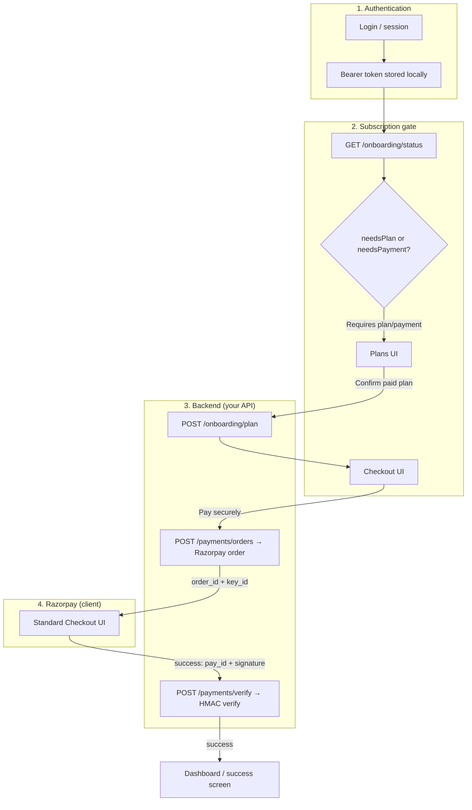
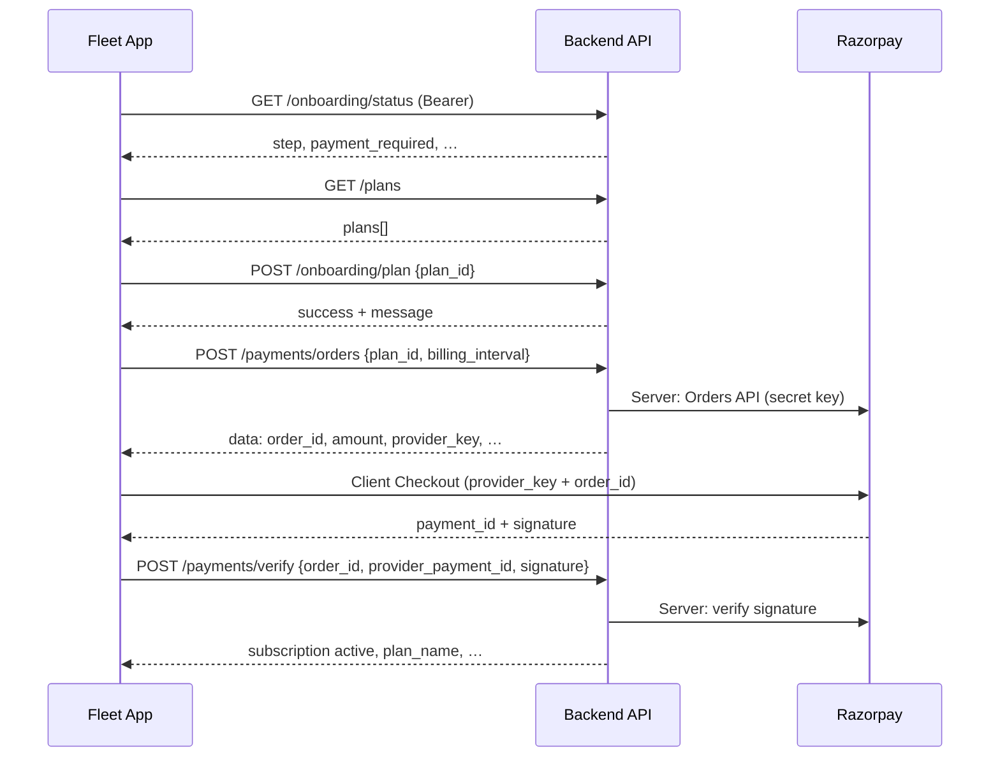

# Payment flow — App ↔ Backend (consolidated)

This document describes the **subscription SaaS payment** path (Razorpay Standard Checkout) as implemented in **IndusJS Fleet**, including HTTP contracts, app behaviour, common failures, and **backend responsibilities**.

**Security:** Do not commit real passwords, Razorpay **secrets**, or live **Key IDs** into source control. Use staging accounts and environment-specific configuration. *(Credentials shared in chat must not be pasted into this file.)*

**Related:** [SCREEN_PAYMENT_PLAN.md](./SCREEN_PAYMENT_PLAN.md) (product spec) · [Razorpay module docs](./Razorpay/README.md) · `ApiConfig` in `ijs-network-lib`

**Backend handoff:** [BACKEND_SUBSCRIPTION_PAYMENT_API_SPEC.md](./BACKEND_SUBSCRIPTION_PAYMENT_API_SPEC.md) — **live-verified** HTTP behaviour, exact JSON the Android app sends, success/error contracts, and `curl` templates (no secrets in repo).

---

## 0. Verified API behaviour & gaps (full stack)

### 0.0 Scope (Kotlin Multiplatform repo)

- This document lives under `**IndusJSFleet_Apps`** and describes **app contracts + observed HTTP behaviour**.
- **Backend repositories are not modified by the KMP agent.** Any fix to Fleet or IAM belongs in the **backend team’s** PR / deploy pipeline.
- **Never commit** real passwords, refresh tokens, or Razorpay secrets in this file. Reproduce calls locally with `curl` using your own credentials.

This section records **live `curl` checks** against `ApiConfig.BASE_URL`, plus **read-only** references to backend source layout (for engineers who work outside this repo).

### 0.1 What was probed (summary)

Re-verified on **2026-04-15** against live `ApiConfig.BASE_URL` with the same request shapes the Android app uses (see [BACKEND_SUBSCRIPTION_PAYMENT_API_SPEC.md](./BACKEND_SUBSCRIPTION_PAYMENT_API_SPEC.md) for full tables and example bodies).


| Step             | Request                                                                                                                                     | HTTP    | Result                                                                                                                                                                                 |
| ---------------- | ------------------------------------------------------------------------------------------------------------------------------------------- | ------- | -------------------------------------------------------------------------------------------------------------------------------------------------------------------------------------- |
| Login            | `POST /auth/login` with `{"identifier":"<email>","password":"<secret>"}`                                                                    | **200** | `success: true`, `data.token` present (JWT).                                                                                                                                           |
| Gate             | `GET /onboarding/status` + Bearer                                                                                                           | **200** | `success: true`. `**step` and flags depend on the user account** (e.g. `payment` + `payment_required` for paywall; another run observed `step: "complete"` after onboarding moved on). |
| Plans            | `GET /plans`                                                                                                                                | **200** | `success: true`, `data.plans` array; plans may include extra fields (e.g. `app_id`) — Kotlin `ignoreUnknownKeys` absorbs this.                                                         |
| Select plan      | `POST /onboarding/plan` + `{"plan_id":"<uuid>"}`                                                                                            | **200** | `success: true`, wrapped `data.message` as expected (when tested).                                                                                                                     |
| **Create order** | `POST /payments/orders` + body `**{"plan_id":"<uuid>","billing_interval":"monthly"}`** (matches `**CreatePaymentOrderRequest**` in the app) | **400** | `errorCode: INDUSJS-FLEET-VALIDATION_ERROR`, `fields.BillingInterval: "this field is required"`, `statusCode: 400`. Body is **not** `SubscriptionApiResponse`.                         |


**Conclusion:** The **Kotlin app sends** `plan_id` and `billing_interval` as required by **IndusJS-IAM**’s DTO. The **deployed Fleet API** still returns **400** because the **Fleet → IAM proxy** does not forward `billing_interval` to IAM (see **§0.2**). That matches the **“Pay securely” / create order** failure users see until the backend is corrected **outside this repo**.

### 0.2 Root cause (read-only analysis: Fleet → IAM)

IndusJS-IAM expects (see `IndusJS-IAM/internal/application/dto/payment_dto.go` in the IAM repo):

```go
type CreatePaymentOrderRequest struct {
    PlanID          uuid.UUID `json:"plan_id" binding:"required"`
    BillingInterval string    `json:"billing_interval" binding:"required,oneof=monthly annual"`
}
```

The **Fleet** service’s `CreatePaymentOrder` path (see `**IndusJSFleet_GoLang_Backend`**, not edited from KMP) binds `**plan_id**` from the client but the **IAM client** builds the upstream body as `**{"plan_id": "<id>"}`** only — `**billing_interval` is dropped** before IAM. IAM validation then fails with `**BillingInterval: this field is required`**.

**Recommended fix (backend team only):** accept `billing_interval` on the Fleet handler and include it in the JSON forwarded to IAM `POST /api/v1/payments/orders`. Deploy Fleet (or align IAM to a default — product decision).

### 0.3 Error-shape mismatch (app vs Fleet validation errors)


| Shape                                                      | Example                                                                                                                    |
| ---------------------------------------------------------- | -------------------------------------------------------------------------------------------------------------------------- |
| **Subscription success** (what repositories assume on 2xx) | `{"success":true,"message":"…","data":{…}}`                                                                                |
| **Fleet / IAM validation error** (observed on **400**)     | `{"errorCode":"INDUSJS-FLEET-VALIDATION_ERROR","errorMessage":"…","developerMessage":"…","fields":{…},"statusCode":400,…}` |


These are **not** the same type. Depending on Ktor settings and status code, the client may get a **deserialization exception** (toast shows exception message) or a parsed response with `**data: null`** (repository throws **“Failed to create payment order”**). Treat **HTTP status** and **Logcat / Kermit** (`TAG_SUBSCRIPTION_REPO`) as source of truth when debugging.

### 0.4 Amount units (follow-up check)

Live `GET /plans` returned e.g. `**monthly_price`: 1000** for a paid plan. The Compose UI formats amounts as **paise → rupees** (`Plan` divides by 100). Confirm with backend whether catalog prices are **paise** (then 1000 = ₹10) or **whole rupees** (then UI is wrong). Razorpay `**amount`** in create-order must match **what IAM sends** (typically **paise** for INR).

### 0.5 Remaining gaps (checklist)


| #   | Gap                                                                                      | Owner                                                                   |
| --- | ---------------------------------------------------------------------------------------- | ----------------------------------------------------------------------- |
| 1   | **Fleet proxy omits `billing_interval` toward IAM** → **400** on `POST /payments/orders` | **Backend (Fleet)** — fix + deploy outside KMP repo.                    |
| 2   | `**selectPlan` success not checked** in `SubscriptionRepositoryImpl`                     | **App** (optional hardening).                                           |
| 3   | **Error JSON** on 4xx not aligned with `SubscriptionApiResponse`                         | **Backend** (consistent envelope) **or** **App** (typed error parsing). |
| 4   | **CORS** for web on subscription routes                                                  | **Backend / gateway**.                                                  |
| 5   | **Razorpay verify** must use server secret                                               | **IAM / payment** service.                                              |
| 6   | **Plan price unit** (paise vs rupees)                                                    | **Product + API** contract.                                             |


---

## 1. High-level flow (visual)




---

## 2. Sequence diagram (happy path)




---

## 3. Base URL (app configuration)


| Source                                   | Value                                                                                          |
| ---------------------------------------- | ---------------------------------------------------------------------------------------------- |
| `ApiConfig.BASE_URL` (`ijs-network-lib`) | `https://indusjsfleet-api-clean-architecture-refactor-960880113496.asia-south1.run.app/api/v1` |


All paths below are **relative to this base** (unless you change `BASE_URL` for another environment).

---

## 4. API reference (subscription payment)

### 4.1 Wrapper shape (all subscription endpoints)

The Kotlin client expects JSON compatible with:

```json
{
  "success": true,
  "message": "optional human text",
  "data": { }
}
```

Defined as `SubscriptionApiResponse<T>` in `screen-payment` (`SubscriptionDto.kt`). If `data` is `**null**` for a call that requires a body, the repository throws an `**ApiException**` and the UI shows a snackbar (message from server when present).

**Backend gap risk:** If the API returns **200** with a different envelope (e.g. no `data`, or `result` instead of `data`), the app will fail deserialization or treat the call as failed.

---

### 4.2 `GET /onboarding/status`


|             |                                                                            |
| ----------- | -------------------------------------------------------------------------- |
| **Auth**    | Bearer                                                                     |
| **Purpose** | Decide subscription gate after login (`App.kt` → `checkSubscriptionGate`). |


**App logic** (`OnboardingStatus`):


| Field (JSON)       | App usage                                                     |
| ------------------ | ------------------------------------------------------------- |
| `step`             | `verify` / `plan` / `payment` / `complete` → `OnboardingStep` |
| `payment_required` | Part of `needsPayment`                                        |
| `payment_done`     | Part of `needsPayment`                                        |
| `selected_plan`    | Optional `PlanDto`                                            |


**Gate rules:**

- `needsPlanSelection` ⇔ `step == "plan"`
- `needsPayment` ⇔ `step == "payment"` **OR** `(payment_required && !payment_done)`


| App outcome             | User lands on                         |
| ----------------------- | ------------------------------------- |
| `RequiresPlanSelection` | Subscription **plans**                |
| `RequiresPayment`       | Subscription **plans** (renewal flag) |
| `NoGate`                | **Dashboard**                         |


**Typical errors**


| Symptom                  | Likely cause                                                                                                                   |
| ------------------------ | ------------------------------------------------------------------------------------------------------------------------------ |
| User skips payment gate  | `getOnboardingStatus` failed → app treats as **NoGate** (non-blocking catch). Backend should return consistent `step` / flags. |
| Wrong screen after login | `step` / `payment_required` / `payment_done` inconsistent with product rules.                                                  |


---

### 4.3 `GET /plans`


|             |                                 |
| ----------- | ------------------------------- |
| **Auth**    | None in client (public catalog) |
| **Purpose** | Load plan cards.                |


**Expected `data` shape** (`PlansWrapperDto`):

```json
{
  "success": true,
  "data": {
    "plans": [
      {
        "id": "uuid",
        "name": "Pro",
        "monthly_price": 49900,
        "annual_price": 499000,
        "currency": "INR",
        "is_active": true,
        "…": "…"
      }
    ]
  }
}
```

**Typical errors**


| Symptom                | Likely cause                                         |
| ---------------------- | ---------------------------------------------------- |
| “Failed to load plans” | `data` missing or `data.plans` missing / wrong type. |


---

### 4.4 `POST /onboarding/plan`


|             |                                                                                |
| ----------- | ------------------------------------------------------------------------------ |
| **Auth**    | Bearer                                                                         |
| **Purpose** | Persist selected plan before payment (paid plans) or complete free onboarding. |


**Request body** (`SelectPlanRequest`):

```json
{
  "plan_id": "uuid-from-plans-catalog"
}
```

**Response** (`SubscriptionApiResponse<SelectPlanMessageDto>`):

```json
{
  "success": true,
  "data": {
    "message": "Plan selected…"
  }
}
```

**App behaviour note (gap):** `SubscriptionRepositoryImpl.selectPlan` currently **does not** inspect `success` / `message`; it only fails on transport/serialization exceptions. A `**success: false`** body could still allow navigation to checkout in edge cases. **Backend should** return **HTTP error codes** for real failures so the client fails loudly.

---

### 4.5 `POST /payments/orders` — **critical for “Pay securely”**


|             |                                                                                                    |
| ----------- | -------------------------------------------------------------------------------------------------- |
| **Auth**    | Bearer                                                                                             |
| **Purpose** | Create a **Razorpay order** on the server and return everything the client needs to open Checkout. |


**Request body** (`CreatePaymentOrderRequest`):

```json
{
  "plan_id": "uuid",
  "billing_interval": "monthly"
}
```

Allowed `billing_interval` values in app: `**monthly**`, `**annual**` (`BillingInterval.apiValue`).

**Success `data` shape** (`PaymentOrderDto` — field names must match **snake_case**):

```json
{
  "success": true,
  "data": {
    "order_id": "order_RazorpayIdFromServer",
    "payment_id": "internal-payment-record-id",
    "amount": 49900,
    "currency": "INR",
    "provider_key": "rzp_test_xxxxxxxxxxxx",
    "provider_name": "razorpay",
    "receipt_id": "rcpt_xxx",
    "customer_email": "user@example.com",
    "customer_name": "Jane Doe"
  }
}
```


| Field                          | Required for Razorpay | Notes                                                                                                                                  |
| ------------------------------ | --------------------- | -------------------------------------------------------------------------------------------------------------------------------------- |
| `order_id`                     | **Yes**               | Must be the Razorpay **order id** created with your server secret.                                                                     |
| `amount`                       | **Yes**               | **Paise** (INR × 100). Must match the Razorpay order amount.                                                                           |
| `currency`                     | **Yes**               | e.g. `INR`                                                                                                                             |
| `provider_key`                 | **Yes** (server)      | Publishable **Key ID** only. App has a **temporary test fallback** if empty (`SubscriptionPaymentTestConfig`) — remove for production. |
| `payment_id`                   | Internal              | App maps to `internalPaymentId` (not Razorpay `pay_` id).                                                                              |
| `receipt_id` / customer fields | Recommended           | Passed through to checkout JSON.                                                                                                       |


**Typical errors (this is the “Failed to create payment order” area)**


| User-visible / logged                                                   | Cause                                                                                                                                    |
| ----------------------------------------------------------------------- | ---------------------------------------------------------------------------------------------------------------------------------------- |
| “Failed to create payment order…” / `data=null` in logs                 | `data` missing, wrong envelope, or HTTP body not JSON.                                                                                   |
| **400** + `BillingInterval` / `billing_interval` validation (Fleet/IAM) | Fleet → IAM proxy omits `billing_interval` (see **§0.2**). **Backend (Fleet)** must forward it and redeploy (out of scope for KMP repo). |
| “order_id is missing…”                                                  | `data` present but `order_id` blank / wrong key name (`orderId` camelCase won’t map unless backend sends snake_case as in DTO).          |
| Network / 401                                                           | Token missing/expired; 401 on authenticated calls may trigger session expiry flow.                                                       |
| 404 / 501                                                               | Route not implemented on deployed API.                                                                                                   |


---

### 4.6 `POST /payments/verify`


|             |                                                                |
| ----------- | -------------------------------------------------------------- |
| **Auth**    | Bearer                                                         |
| **Purpose** | Server verifies Razorpay signature and activates subscription. |


**Request body** (`VerifyPaymentRequest`):

```json
{
  "order_id": "order_xxx",
  "provider_payment_id": "pay_xxx",
  "signature": "razorpay_signature_hex"
}
```

**Success `data`** (`PaymentVerifyResponseDto` — partial):

```json
{
  "success": true,
  "data": {
    "payment_id": "internal-uuid",
    "provider_id": "pay_xxx",
    "status": "captured",
    "plan_name": "Pro",
    "amount": 49900,
    "currency": "INR",
    "subscription_id": "uuid",
    "message": "Payment successful…"
  }
}
```

**Typical errors**


| Symptom                       | Likely cause                                                                            |
| ----------------------------- | --------------------------------------------------------------------------------------- |
| “Payment verification failed” | `data` null, signature mismatch, wrong `order_id`, clock skew, test vs live keys mixed. |


---

## 5. Razorpay: who does what


| Task                                                   | Where                                                   |
| ------------------------------------------------------ | ------------------------------------------------------- |
| Create Razorpay **Order** (server API with **secret**) | **Backend**                                             |
| Return `order_id`, `amount`, `provider_key` (Key ID)   | **Backend** → app                                       |
| Open Standard Checkout                                 | **App** (Android SDK / iOS WebView / Web `checkout.js`) |
| Return `pay_id` + `signature` to app                   | **Razorpay** → app callback                             |
| Verify **signature** (HMAC)                            | **Backend** only (`/payments/verify`)                   |
| Store **Razorpay secret**                              | **Backend / vault** — never in mobile or web bundle     |


---

## 6. Client-side payment steps (after order API succeeds)

1. `PaymentCheckoutViewModel` sends `Effect.LaunchRazorpayCheckout(RazorpayCheckoutData)`.
2. `PaymentCheckoutScreen` calls `razorpayLauncher` (platform-specific).
3. JSON options include `key` = `provider_key`, `order_id`, `amount`, etc. (`RazorpayTypes.toRazorpaySdkOptionsJson`).
4. On success → `Intent.RazorpaySuccess` → `verifyPaymentUseCase` → `POST /payments/verify`.

**Razorpay integration details:** [Razorpay/README.md](./Razorpay/README.md)

---

## 7. Web-specific (JS / Wasm)


| Topic                  | Requirement                                                                                 |
| ---------------------- | ------------------------------------------------------------------------------------------- |
| **CORS**               | Browser must be allowed to call `BASE_URL` from your web origin (`POST` + `Authorization`). |
| **Razorpay script**    | `webApp` `index.html` loads `checkout.js` before the app bundle.                            |
| **Checkout behaviour** | Same `order_id` / `amount` / `key` as Android.                                              |


---

## 8. Error → where to look (quick matrix)


| UI / symptom                                | Check first                                                                                                                                        |
| ------------------------------------------- | -------------------------------------------------------------------------------------------------------------------------------------------------- |
| Toast after **Pay securely** (create order) | `POST /payments/orders`: see **§0** (Fleet must forward `billing_interval` to IAM); also check `data` / `order_id` / `TAG_SUBSCRIPTION_REPO` logs. |
| Checkout opens then fails                   | Amount / currency / `order_id` mismatch with Razorpay order; wrong `provider_key`.                                                                 |
| Verify always fails                         | Backend verify: secret, payload order, `pay_id` / `signature` fields.                                                                              |
| Plans empty                                 | `GET /plans` → `data.plans`.                                                                                                                       |
| Gate wrong                                  | `GET /onboarding/status` → `step`, `payment_required`, `payment_done`.                                                                             |
| Instant “cancelled” Razorpay (web)          | `App` not given real `razorpayLauncher` (see `webApp` / `main.kt`).                                                                                |


---

## 9. Backend / contract checklist (gaps to close)

Use this as a **server-side QA** list against the deployed `BASE_URL`.

1. [ ] **Fleet → IAM** forwards `**billing_interval`** on create-order (see **§0**); then redeploy Fleet so `POST /payments/orders` succeeds for real devices.
2. [ ] `**POST /api/v1/payments/orders`** returns `**{ "success": true, "data": { … } }**` on success (not a bare order object without wrapper, unless you change the app DTOs).
3. [ ] `**data.order_id**` is non-empty and equals the Razorpay order id created server-side.
4. [ ] `**data.amount**` is in **paise** and matches that Razorpay order.
5. [ ] `**data.provider_key`** is the correct **publishable Key ID** for the environment (test vs live).
6. [ ] `**billing_interval`** accepts `**monthly**` and `**annual**` exactly (snake_case body keys as in app and IAM).
7. [ ] `**POST /api/v1/payments/verify**` implements Razorpay **signature verification** and returns the `PaymentVerifyResponseDto` fields the app expects.
8. [ ] `**GET /onboarding/status`** returns consistent `**step**` / `**payment_required**` / `**payment_done**` for gating.
9. [ ] `**GET /plans**` returns `**data.plans**` array with `**id**` matching `**plan_id**` used in create order.
10. [ ] **Select plan** failures return **non-2xx** or `**success: false`** with a clear `message` (app should be hardened to read `success` — optional follow-up).
11. [ ] **Web:** CORS allows browser clients for all subscription endpoints used after login.

---

## Appendix A — `curl` reproduction (no secrets in command history for docs)

Use **environment variables** locally; do not paste real passwords into committed scripts.

```bash
export FLEET_BASE='https://indusjsfleet-api-clean-architecture-refactor-960880113496.asia-south1.run.app/api/v1'
export FLEET_EMAIL='…'
export FLEET_PASSWORD='…'

TOKEN=$(curl -sS -X POST "$FLEET_BASE/auth/login" \
  -H 'Content-Type: application/json' \
  -d "{\"identifier\":\"$FLEET_EMAIL\",\"password\":\"$FLEET_PASSWORD\"}" \
  | python3 -c "import sys,json; print((json.load(sys.stdin).get('data') or {}).get('token') or '')")

curl -sS "$FLEET_BASE/onboarding/status" -H "Authorization: Bearer $TOKEN" | python3 -m json.tool

curl -sS "$FLEET_BASE/plans" | python3 -m json.tool

# Paid plan UUID from GET /plans (example shape only)
PLAN_ID='00000000-0000-0000-0000-000000000000'

curl -sS -w "\nHTTP %{http_code}\n" -X POST "$FLEET_BASE/payments/orders" \
  -H "Authorization: Bearer $TOKEN" \
  -H 'Content-Type: application/json' \
  -d "{\"plan_id\":\"$PLAN_ID\",\"billing_interval\":\"monthly\"}"
```

**Observed failure body** (when Fleet still drops `billing_interval` toward IAM) — shape only:

```json
{
  "errorCode": "INDUSJS-FLEET-VALIDATION_ERROR",
  "errorMessage": "validation failed: 1 error",
  "developerMessage": "BillingInterval: this field is required",
  "fields": { "BillingInterval": "this field is required" },
  "statusCode": 400
}
```

---

## 10. Optional formats (Excel / CSV)

This file is the **canonical** text spec. If you need Excel:

- Export tables from sections **4** and **8** into a sheet **“Endpoints”** and **“Errors”**.
- Keep **secrets out** of spreadsheets attached to tickets.

---

## 11. Manual test checklist (no secrets in repo)

1. Log in with a **staging** user (password managed outside git).
2. Confirm gate: onboarding status shows expected **step**.
3. Load plans → select paid plan → confirm plan **POST** succeeds (watch network).
4. Tap **Pay securely** → confirm `**POST /payments/orders`** returns full `data` JSON.
5. Complete Razorpay test payment → confirm `**POST /payments/verify**` returns success.
6. Land on success / dashboard per navigation.

---

## 12. Document map


| Topic                   | File                                               |
| ----------------------- | -------------------------------------------------- |
| Product / IAM narrative | [SCREEN_PAYMENT_PLAN.md](./SCREEN_PAYMENT_PLAN.md) |
| Razorpay per module     | [Razorpay/README.md](./Razorpay/README.md)         |
| **This doc**            | **App + backend contracts + errors**               |


---

*Last aligned with Kotlin client in `screen-payment` + `ijs-network-lib` `ApiConfig`. Regenerate or amend when API versions or envelopes change.*