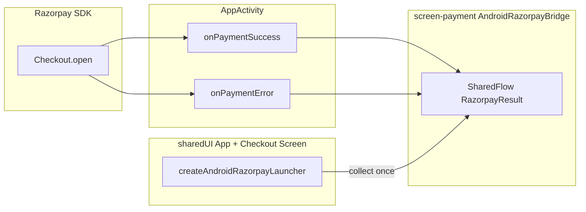

# Razorpay — Integration & Design (`androidApp`)

**Module:** `androidApp`  
**Canonical path:** `Docs/Razorpay/androidApp_RAZORPAY_INTEGRATION.md`

`androidApp` is the **Android application module**. It hosts `AppActivity`, applies the **Razorpay Android Checkout SDK**, and bridges SDK callbacks into **`screen-payment`**’s `AndroidRazorpayBridge` so Compose code only sees `RazorpayResult`.

---

## 1. Responsibilities

| Item | Location |
|------|----------|
| Razorpay SDK dependency | `androidApp/build.gradle.kts` — `com.razorpay:checkout` |
| Implement `PaymentResultWithDataListener` | `AppActivity.kt` |
| Map success / error / user cancel → `RazorpayResult` | `onPaymentSuccess`, `onPaymentError` |
| Pass Android launcher into `App()` | `App(razorpayLauncher = createAndroidRazorpayLauncher(activity))` |
| Dependency on `screen-payment` | Required for `AndroidRazorpayBridge`, factories, types |

---

## 2. Callback flow

1. `createAndroidRazorpayLauncher` opens checkout and **subscribes** to `AndroidRazorpayBridge.results` for **one** emission.
2. `AppActivity` implements Razorpay listener interfaces and calls `AndroidRazorpayBridge.emit(...)`.
3. User cancel is mapped using `Checkout.PAYMENT_CANCELED` → `RazorpayResult.Cancelled` (align with Razorpay SDK version; if the constant is missing, use documented cancel `errorCode`).

---

## 3. Key file: `AppActivity.kt`

- **Implements** `PaymentResultWithDataListener` (package `com.razorpay`).
- **`onPaymentSuccess`** — Builds `RazorpayResult.Success` with `order_id`, `payment_id`, `signature` from `PaymentData`.
- **`onPaymentError`** — Cancel vs failure branching; emits `Cancelled` or `Failed`.
- **`App()`** — Supplies `createAndroidRazorpayLauncher(this)` so the Activity instance matches `Checkout.open(activity, …)`.

---

## 4. Gradle & version alignment

- SDK is declared on **`androidApp`** (runtime host).
- **`screen-payment`** `androidMain` also references the Checkout API for `RazorpayLauncher.android.kt`.

**Recommendation:** Use the **same** `com.razorpay:checkout` version in both `androidApp/build.gradle.kts` and `screen-payment/build.gradle.kts` to avoid duplicate classes or subtle API mismatches. If versions differ today, align them in a single follow-up change.

---

## 5. Manifest / Proguard

- Razorpay SDK typically requires **Internet** permission (usually already present for the app).
- **Release builds:** follow Razorpay’s Proguard/R8 consumer rules if shrinkers strip SDK classes (consult current Razorpay Android integration guide).

---

## 6. Testing checklist (Android)

- [ ] Happy path: test key, test order from backend, verify navigates to success.
- [ ] User presses back / closes checkout → `Cancelled` / appropriate UX copy.
- [ ] Declined test card → `Failed` with message.
- [ ] Airplane mode after order created → failure or timeout per SDK behavior.

---

## 7. Related documents

- [screen-payment_RAZORPAY_INTEGRATION.md](./screen-payment_RAZORPAY_INTEGRATION.md) — `AndroidRazorpayBridge`, `createAndroidRazorpayLauncher`.
- [sharedUI_RAZORPAY_INTEGRATION.md](./sharedUI_RAZORPAY_INTEGRATION.md) — `LocalRazorpayLauncher`.
- `androidApp/AGENTS.md` — general `AppActivity` duties.
