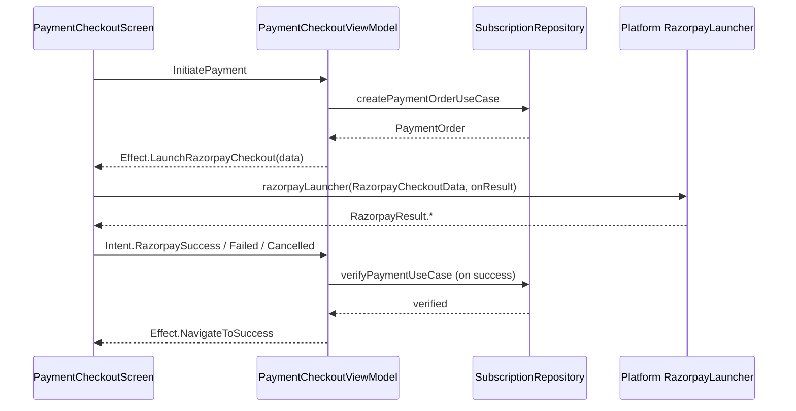

# Razorpay — Integration & Design (`screen-payment`)

**Module:** `screen-payment`  
**Canonical path:** `Docs/Razorpay/screen-payment_RAZORPAY_INTEGRATION.md`

This document describes how **Razorpay Standard Checkout** is modeled, launched, and reconciled **inside the `screen-payment` module** only. Other modules supply host wiring (Activity, HTML, `App()`).

---

## 1. Role of this module

| Concern | Owner |
|--------|--------|
| Domain types for orders / billing | `screen-payment` |
| REST calls: create order, verify payment | `screen-payment` |
| MVI: checkout screen + ViewModel | `screen-payment` |
| **Platform-agnostic** checkout payload & result types | `screen-payment` |
| **Per-target** checkout open (Android / iOS / JS / Wasm) | `screen-payment` (`*Main`) |

Razorpay **never** executes in `commonMain` code paths; `commonMain` only defines data contracts and calls a `RazorpayLauncher` lambda injected from outside.

---

## 2. End-to-end flow (logical)

1. **Create order** — Backend returns Razorpay `order_id`, amount (paise), `currency`, `key_id`, receipt, customer hints.
2. **Launch checkout** — `RazorpayCheckoutData` is converted to SDK/JS JSON via `toRazorpaySdkOptionsJson()` (single canonical shape).
3. **User completes or abandons** — Platform maps outcomes to `RazorpayResult` (`Success` | `Failed` | `Cancelled`).
4. **Verify** — On `Success`, ViewModel calls verify API with `orderId`, `paymentId`, `signature` (server must validate HMAC per Razorpay docs).

---

## 3. Core types (`commonMain`)

| Symbol | Purpose |
|--------|---------|
| `RazorpayCheckoutData` | Inputs for checkout: `orderId`, `amount`, `currency`, `providerKey`, `receiptId`, customer fields, `planName`. |
| `RazorpayResult` | Sealed: `Success(orderId, paymentId, signature)`, `Failed(code, description)`, `Cancelled`. |
| `RazorpayLauncher` | `(RazorpayCheckoutData, (RazorpayResult) -> Unit) -> Unit` — opens checkout once, invokes callback exactly once per session (enforced by platform / HTML bridge where applicable). |
| `toRazorpaySdkOptionsJson()` | JSON for Android `JSONObject`, iOS WKWebView, JS `Razorpay(options)`, Wasm bridge. |
| `parseRazorpayWebBridgeResultJson(String)` | Parses the **web** bridge line protocol: `{ "type": "success"|"failed"|"dismiss", ... }`. |

---

## 4. Presentation layer

- **`PaymentCheckoutContract`** — States, intents (`RazorpaySuccess`, `RazorpayFailed`, `RazorpayCancelled`), effect `LaunchRazorpayCheckout`.
- **`PaymentCheckoutViewModel`** — `initiatePayment()` → order API → emits checkout effect; `verifyPayment()` on success intent.
- **`PaymentCheckoutScreen`** — Collects effects; on `LaunchRazorpayCheckout`, calls `razorpayLauncher` and maps results to intents.
- **`SubscriptionFeatureFacade`** — Composable entry used by `sharedUI`; takes `razorpayLauncher` as a parameter.

---

## 5. Platform implementations

| Target | File | Mechanism |
|--------|------|-----------|
| Android | `androidMain/.../RazorpayLauncher.android.kt` | `Checkout.open(activity, JSONObject(...))`; results via `AndroidRazorpayBridge` (Activity implements Razorpay listener — see `androidApp` doc). |
| iOS | `iosMain/.../RazorpayLauncher.ios.kt` | WKWebView loads `checkout.js`; options as base64; `WKScriptMessageHandler` maps JSON messages to `RazorpayResult`. |
| JS | `jsMain/.../RazorpayLauncher.js.kt` | Prefers `globalThis.__IndusFleetRazorpay.open` when present; else direct `new Razorpay(options)`. Coerces string `error.code` on failure path. |
| Wasm | `wasmJsMain/.../RazorpayLauncher.wasmJs.kt` | `@JsFun` calls `__IndusFleetRazorpay.open(payloadJson, onDone)`; parses with `parseRazorpayWebBridgeResultJson`. |

Factory entry points (public):

- `createAndroidRazorpayLauncher(Activity)`
- `createIosRazorpayLauncher()`
- `createWebRazorpayLauncher()`
- `createWasmJsRazorpayLauncher()`

---

## 6. Data & API assumptions

Remote endpoints (see repository / data source in this module) must:

- Return a **server-created** Razorpay order id (never craft orders only on device).
- Return **`key_id`** suitable for the client (test vs live).
- Accept verify payload with **payment_id** + **signature** for server-side HMAC verification.

---

## 7. Dependencies

- **`androidMain`**: `com.razorpay:checkout` (version in `screen-payment/build.gradle.kts`; **should match** consuming `androidApp` to avoid duplicate-class / behavior drift).
- **`commonMain`**: `kotlinx-serialization` for JSON helpers.

---

## 8. Testing matrix (module-level)

| Case | Expected `RazorpayResult` |
|------|---------------------------|
| User pays successfully | `Success` with non-empty `paymentId` / `signature` |
| User closes modal / back | `Cancelled` (Android: `Checkout.PAYMENT_CANCELED` where applicable) |
| Card / UPI failure | `Failed` with Razorpay error description |
| Order API failure | No checkout; VM error state only |

---

## 9. Related documents

- [sharedUI_RAZORPAY_INTEGRATION.md](./sharedUI_RAZORPAY_INTEGRATION.md) — composition, navigation, DI.
- [webApp_RAZORPAY_INTEGRATION.md](./webApp_RAZORPAY_INTEGRATION.md) — HTML bridge & web entry.
- [androidApp_RAZORPAY_INTEGRATION.md](./androidApp_RAZORPAY_INTEGRATION.md) — Activity listener & Gradle SDK.
- [iosApp_RAZORPAY_INTEGRATION.md](./iosApp_RAZORPAY_INTEGRATION.md) — host app / ATS (no checkout code in `iosApp`).
- [../SCREEN_PAYMENT_PLAN.md](../SCREEN_PAYMENT_PLAN.md) — product-wide payment architecture.
